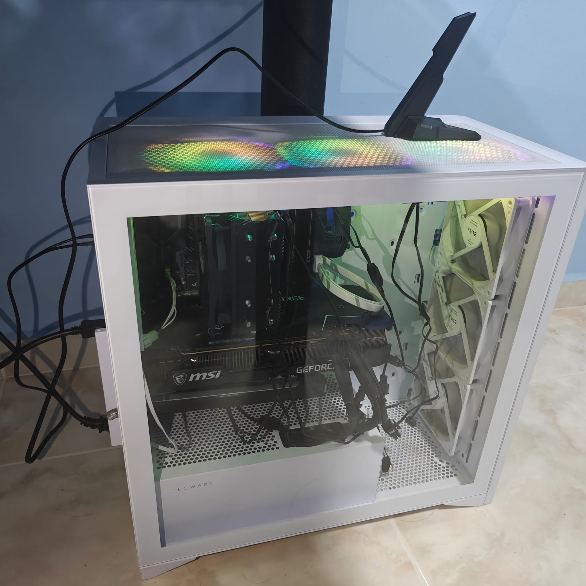

# Premium AI/LLM Home-Lab Server | 24GB GPU VRAM | Ryzen 9 16-Core / 32-Thread Beast| 32GB DDR4 RAM

## Overview
I meticulously engineered this turn-key, premium Server for heavy deep learning workloads, local Large Language Model (LLM) fine-tuning, and ultra-low latency inference. The system features a massive 24GB GPU VRAM pool coupled with a flagship 16-core AMD processor; it represents an ideal balance for data scientists, AI researchers, and developers demanding autonomous, efficient home-lab compute.

---

## Core Architectural & AI Capabilities
* **24GB GDDR6X VRAM For Unrestricted AI Development:** Powered by the NVIDIA GeForce RTX 3090, this system provides 24GB of high-speed video memory. This allows running large foundational models (such as Llama 3 8B or Mistral 7B) completely unquantized at blazing speeds, or deploying tightly quantized variants of massive 40B parameter architectures directly on the server without clipping context windows.
* **Hardware-Accelerated Machine Learning:** Built on NVIDIA's Ampere architecture, the system leverages dedicated Gen 3 Tensor Cores to accelerate mixed-precision ($FP16/BF16$) training, local embedding generation, and token generation steps.
* **Massive L3 Cache Buffer:** The host CPU includes a 64MB L3 cache that minimizes data latency when preprocessing large token datasets or feeding complex feature matrices into memory.

---

## Detailed Technical Specifications

| Component Group | Component Details & Premium Specifications |
| :--- | :--- |
| **Processor (CPU)** | **AMD Ryzen 9 5950X Flagship Processor**  • 16 Physical Cores / 32 Threads for high-throughput multi-processing  • Base Clock: 3.45 GHz \| Max Boost Clock: Up to 5.08 GHz  • **L1 Cache:** 1 MB  • **L2 Cache:** 8 MB  • **L3 Cache:** 64 MB Ultra-Buffering  |
| **Graphics (GPU)** | **NVIDIA Corporation GA102 [GeForce RTX 3090]**  • **VRAM:** 24GB GDDR6X Capacity  • **Bus Width:** 384-bit Premium High-Bandwidth Interface  • **Architecture:** Ampere (Featuring Gen 3 Tensor Cores, Ray Tracing Cores) |
| **System Memory (RAM)**| **32GB Total System Memory**  • 2 x 16GB Dual-Channel Module Array  • Brand: KLEVV (Premium High-Stability Module Set)  • Type: DDR4 Synchronous Unbuffered Non-ECC \| Speed: 2400 MHz  |
| **Storage Architecture**| **1TB Crucial PCIe NVMe Solid State Drive**  • Hardware Model: Crucial/Micron CT1000P3PSSD8 • Optimized Partitioning: Turn-key Dual-Boot layout with standard EXT4 Linux environment for raw AI libraries (`/dev/nvme0n1p5`) alongside a Windows volume footprint. |
| **Motherboard & Platform**| **ASUSTeK COMPUTER INC. TUF GAMING X570-PLUS (WI-FI)**  • Chipset: Premium AMD X570 PCIe 4.0 Ready Infrastructure  • Features ASUS AURA LED Integrated Controller for customizable aesthetic layouts. |
| **Networking & Connectivity**| **Dual-Tier High-Speed Connectivity Network** • **Wireless:** Intel Wireless-AC 9260 WiFi 5 + Integrated Bluetooth Adapter  • **Wired Ethernet:** Realtek RTL8111/8168/8211/8411 PCI Express Gigabit Ethernet Controller |

---

## Why This Setup is Perfect for my AI Home-Lab

* **Immediate Savings on Cloud Spending:** Owning a local 24GB frame buffer eliminates recurring API access subscriptions and steep hourly compute costs from public cloud providers. Run deep learning pipelines continuously without hidden fees.
* **The Linux AI Standard:** Configured with an expansive native EXT4 Linux volume partition layout, the machine is optimally designed for instant compatibility with `PyTorch`, `TensorFlow`, `Hugging Face Transformers`, and local inference frontends like `Ollama` or `vLLM` without the overhead layer of WSL.
* **Overbuilt for Multi-Tasking Parallel Data Pipelines:** With 32 logical CPU threads available, the system can parse large text dumps, tokenize text datasets, format JSON records, and handle asynchronous data loading while the GPU runs at 100% capacity.
* **Freedom to explore and experiment:** The fastest way to keep my hands busy with new tools and software and clean it up when I am done
* **To Know The Limitations:** A way to explore the limitations of both my server and myself.

---

## Operating System

Ubuntu 26.04 LTS is installed.

## LLM installed so far
* Qwen Coder 3.6 35B-A3B (Installed via Ollama)
* Gemma4 26B

## In the search for agents
* I have installed Hermes Agent by Nous Research to automate tasks and try out agentic coding via FreeClaudeCode.

## Day 1 Hurdle
* My system was shipped with the V1 MSI CoreLiquid 360R CPU cooler which has known issues, which lead to me subsequetly replacing it with a Thermalright Peerless Assassin 120 SE with a new layer of thermal paste.

### Glimpse of My Server
